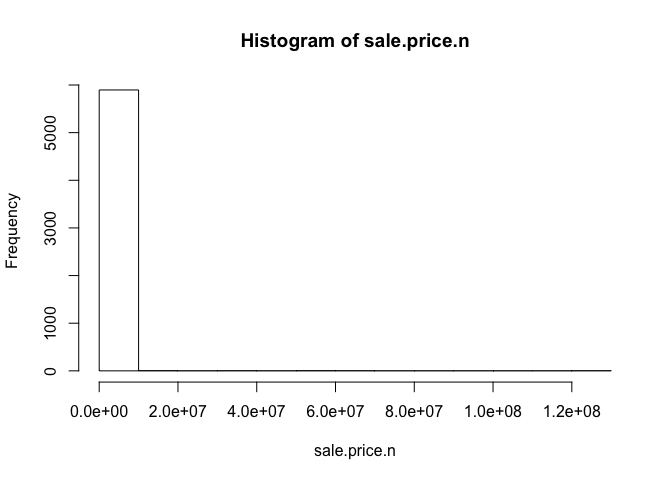
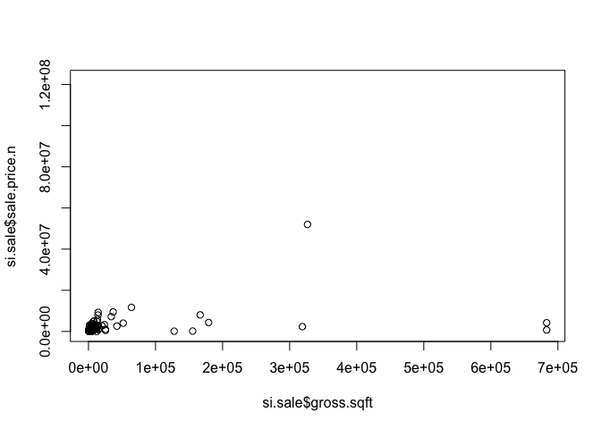
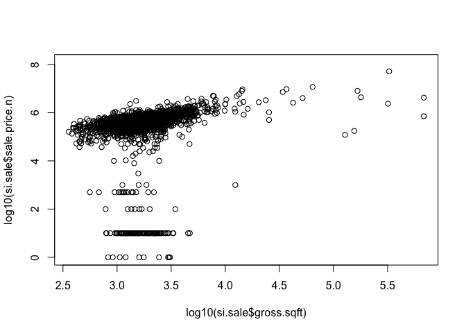
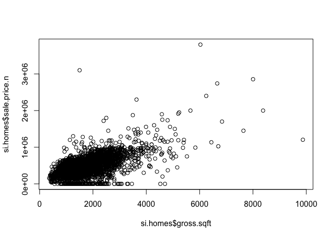
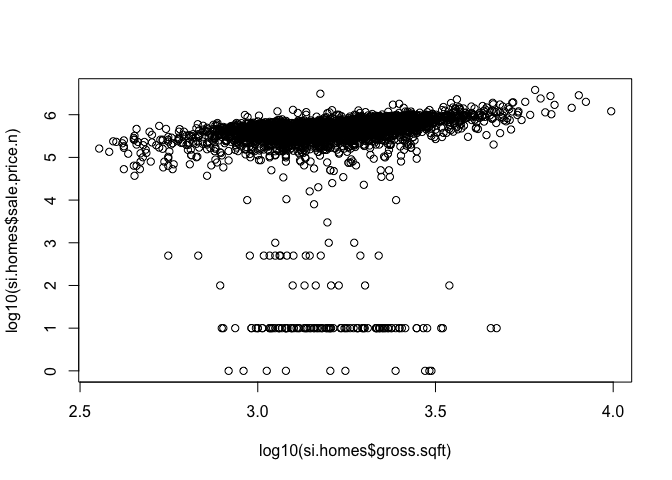
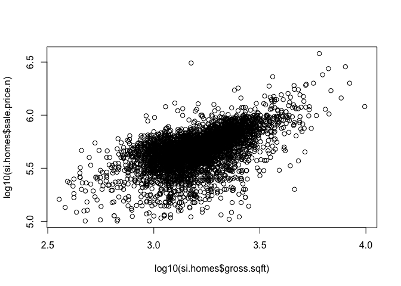

# MSSMUDSWK6
Chiranjeevi Mallavarapu  
6/23/2017  


```r
knitr::opts_chunk$set(echo = TRUE)
source('DataAnalysis/PrepData.R')
```

```
## 'data.frame':	8081 obs. of  21 variables:
##  $ BOROUGH                       : int  5 5 5 5 5 5 5 5 5 5 ...
##  $ NEIGHBORHOOD                  : Factor w/ 58 levels "ANNADALE                 ",..: 1 1 1 1 1 1 1 1 1 1 ...
##  $ BUILDING.CLASS.CATEGORY       : Factor w/ 29 levels "01  ONE FAMILY DWELLINGS                    ",..: 1 1 1 1 1 1 1 1 1 1 ...
##  $ TAX.CLASS.AT.PRESENT          : Factor w/ 10 levels "  ","1","1A",..: 2 2 2 2 2 2 2 2 2 2 ...
##  $ BLOCK                         : int  5391 5397 5408 6205 6209 6211 6211 6212 6212 6212 ...
##  $ LOT                           : int  30 60 7 24 69 4 15 47 50 59 ...
##  $ EASE.MENT                     : logi  NA NA NA NA NA NA ...
##  $ BUILDING.CLASS.AT.PRESENT     : Factor w/ 81 levels "  ","A0","A1",..: 3 3 4 6 6 6 6 6 6 6 ...
##  $ ADDRESS                       : Factor w/ 7459 levels "1 BOLIVAR STREET                         ",..: 807 3740 1986 6565 2011 3954 1544 4628 4082 6975 ...
##  $ APARTMENT.NUMBER              : Factor w/ 278 levels "            ",..: 1 1 1 1 1 1 1 1 1 1 ...
##  $ ZIP.CODE                      : int  10312 10312 10312 10312 10312 10312 10312 10312 10312 10312 ...
##  $ RESIDENTIAL.UNITS             : Factor w/ 20 levels " -   "," 1 ",..: 2 2 2 2 2 2 2 2 2 2 ...
##  $ COMMERCIAL.UNITS              : Factor w/ 13 levels " -   "," 1 ",..: 1 1 1 1 1 1 1 1 1 1 ...
##  $ TOTAL.UNITS                   : Factor w/ 25 levels " -   "," 1 ",..: 2 2 2 2 2 2 2 2 2 2 ...
##  $ LAND.SQUARE.FEET              : Factor w/ 2359 levels " -   "," 1,000 ",..: 2144 341 773 282 852 169 169 865 938 219 ...
##  $ GROSS.SQUARE.FEET             : Factor w/ 1693 levels " -   "," 1,000 ",..: 576 1284 1495 553 387 336 336 320 320 356 ...
##  $ YEAR.BUILT                    : int  1952 1984 1930 1986 2007 1986 1986 2000 2000 2005 ...
##  $ TAX.CLASS.AT.TIME.OF.SALE     : int  1 1 1 1 1 1 1 1 1 1 ...
##  $ BUILDING.CLASS.AT.TIME.OF.SALE: Factor w/ 81 levels "A0","A1","A2",..: 2 2 3 5 5 5 5 5 5 5 ...
##  $ SALE.PRICE                    : Factor w/ 1570 levels " -   "," 1 ",..: 1 1 443 794 1134 1 638 1 909 900 ...
##  $ SALE.DATE                     : Factor w/ 311 levels "1/1/2017","1/10/2017",..: 197 256 294 247 69 243 34 38 199 309 ...
```

<!-- --><!-- --><!-- --><!-- --><!-- -->

```
## 'data.frame':	191 obs. of  26 variables:
##  $ borough                       : int  5 5 5 5 5 5 5 5 5 5 ...
##  $ neighborhood                  : Factor w/ 58 levels "ANNADALE                 ",..: 1 1 1 1 2 2 2 2 6 6 ...
##  $ building.class.category       : Factor w/ 29 levels "01  ONE FAMILY DWELLINGS                    ",..: 1 1 1 1 1 1 1 2 1 1 ...
##  $ tax.class.at.present          : Factor w/ 10 levels "  ","1","1A",..: 2 2 2 2 2 2 2 2 2 2 ...
##  $ block                         : int  6254 6297 6321 6371 5741 6014 6055 5777 1681 1703 ...
##  $ lot                           : int  99 19 11 32 148 30 79 23 143 55 ...
##  $ ease.ment                     : logi  NA NA NA NA NA NA ...
##  $ building.class.at.present     : Factor w/ 81 levels "  ","A0","A1",..: 3 3 3 3 6 4 8 10 6 3 ...
##  $ address                       : Factor w/ 7459 levels "1 BOLIVAR STREET                         ",..: 6441 4859 312 526 4755 7026 1596 3521 5947 3460 ...
##  $ apartment.number              : Factor w/ 278 levels "            ",..: 1 1 1 1 1 1 1 1 1 1 ...
##  $ zip.code                      : int  10312 10312 10312 10312 10312 10312 10312 10312 10303 10303 ...
##  $ residential.units             : Factor w/ 20 levels " -   "," 1 ",..: 2 2 2 2 2 2 2 3 7 7 ...
##  $ commercial.units              : Factor w/ 13 levels " -   "," 1 ",..: 1 1 1 1 1 1 1 1 4 4 ...
##  $ total.units                   : Factor w/ 25 levels " -   "," 1 ",..: 2 2 2 2 2 2 2 3 8 8 ...
##  $ land.square.feet              : Factor w/ 2359 levels " -   "," 1,000 ",..: 975 2209 2112 1383 1908 1383 16 540 216 1040 ...
##  $ gross.square.feet             : Factor w/ 1693 levels " -   "," 1,000 ",..: 229 759 1195 799 225 1643 121 952 90 1604 ...
##  $ year.built                    : num  1993 1970 2004 1970 1996 ...
##  $ tax.class.at.time.of.sale     : int  1 1 1 1 1 1 1 1 1 1 ...
##  $ building.class.at.time.of.sale: Factor w/ 81 levels "A0","A1","A2",..: 2 2 2 2 5 3 7 9 5 2 ...
##  $ sale.price                    : Factor w/ 1570 levels " -   "," 1 ",..: 1539 70 2 70 74 2 1400 71 980 2 ...
##  $ sale.date                     : Factor w/ 311 levels "1/1/2017","1/10/2017",..: 178 246 189 109 3 269 214 61 300 8 ...
##  $ sale.price.n                  : num  95000 10 1 10 100 1 79500 10000 500 1 ...
##  $ address.c                     : chr  "75 SOUTH RAILROAD ST                     " "442 LAMONT AVENUE                        " "11 ALVINE AVENUE                         " "118 JANSEN STREET                        " ...
##  $ apartment.number.c            : chr  "            " "            " "            " "            " ...
##  $ gross.sqft                    : num  1362 2148 3040 2208 1354 ...
##  $ land.sqft                     : num  2960 8000 7250 4000 500 ...
## 'data.frame':	4658 obs. of  27 variables:
##  $ borough                       : int  5 5 5 5 5 5 5 5 5 5 ...
##  $ neighborhood                  : Factor w/ 58 levels "ANNADALE                 ",..: 1 1 1 1 1 1 1 1 1 1 ...
##  $ building.class.category       : Factor w/ 29 levels "01  ONE FAMILY DWELLINGS                    ",..: 1 1 1 1 1 1 1 1 1 1 ...
##  $ tax.class.at.present          : Factor w/ 10 levels "  ","1","1A",..: 2 2 2 2 2 2 2 2 2 2 ...
##  $ block                         : int  5408 6205 6209 6211 6212 6212 6212 6214 6215 6216 ...
##  $ lot                           : int  7 24 69 15 50 59 154 12 35 33 ...
##  $ ease.ment                     : logi  NA NA NA NA NA NA ...
##  $ building.class.at.present     : Factor w/ 81 levels "  ","A0","A1",..: 4 6 6 6 6 6 3 4 3 6 ...
##  $ address                       : Factor w/ 7459 levels "1 BOLIVAR STREET                         ",..: 1986 6565 2011 1544 4082 6975 637 1033 686 24 ...
##  $ apartment.number              : Factor w/ 278 levels "            ",..: 1 1 1 1 1 1 1 1 1 1 ...
##  $ zip.code                      : int  10312 10312 10312 10312 10312 10312 10312 10312 10312 10312 ...
##  $ residential.units             : Factor w/ 20 levels " -   "," 1 ",..: 2 2 2 2 2 2 2 2 2 2 ...
##  $ commercial.units              : Factor w/ 13 levels " -   "," 1 ",..: 1 1 1 1 1 1 1 1 1 1 ...
##  $ total.units                   : Factor w/ 25 levels " -   "," 1 ",..: 2 2 2 2 2 2 2 2 2 2 ...
##  $ land.square.feet              : Factor w/ 2359 levels " -   "," 1,000 ",..: 773 282 852 169 938 219 1491 1491 2144 679 ...
##  $ gross.square.feet             : Factor w/ 1693 levels " -   "," 1,000 ",..: 1495 553 387 336 320 356 975 842 1133 330 ...
##  $ year.built                    : num  1930 1986 2007 1986 2000 ...
##  $ tax.class.at.time.of.sale     : int  1 1 1 1 1 1 1 1 1 1 ...
##  $ building.class.at.time.of.sale: Factor w/ 81 levels "A0","A1","A2",..: 3 5 5 5 5 5 2 3 2 5 ...
##  $ sale.price                    : Factor w/ 1570 levels " -   "," 1 ",..: 443 794 1134 638 909 900 1363 1280 1291 647 ...
##  $ sale.date                     : Factor w/ 311 levels "1/1/2017","1/10/2017",..: 294 247 69 34 199 309 250 153 38 193 ...
##  $ sale.price.n                  : num  290000 425000 579000 370000 470000 ...
##  $ address.c                     : chr  "192 BATHGATE STREET                      " "79 EAGAN AVENUE                          " "195 MOSELY AVENUE                        " "17 EAGAN AVENUE                          " ...
##  $ apartment.number.c            : chr  "            " "            " "            " "            " ...
##  $ gross.sqft                    : num  572 1854 1592 1521 1500 ...
##  $ land.sqft                     : num  2500 1845 2665 1508 2870 ...
##  $ outliers                      : num  0 0 0 0 0 0 0 0 0 0 ...
```

<!-- -->

## R Markdown

This is an R Markdown document. Markdown is a simple formatting syntax for authoring HTML, PDF, and MS Word documents. For more details on using R Markdown see <http://rmarkdown.rstudio.com>.
